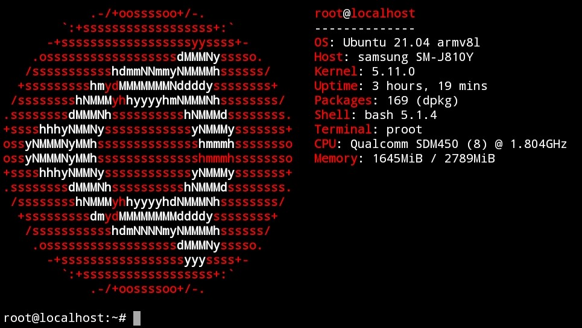

## Ubuntu 21.04 (Hirsute Hippo) in Termux

## Installation
```
curl --silent --location --remote-name https://github.com/trungtai33/ubuntu-hirsute-in-termux/raw/master/installation/ubuntu-hirsute.sh && bash ubuntu-hirsute.sh && rm ubuntu-hirsute.sh
```
After install, run ```start-ubuntu-hirsute``` to login.
## Uninstall
Be careful when using this command as it does not ask for confirmation.
```
curl --silent --location --remote-name https://github.com/trungtai33/ubuntu-hirsute-in-termux/raw/master/uninstall/ubuntu-hirsute.sh && bash ubuntu-hirsute.sh && rm ubuntu-hirsute.sh
```