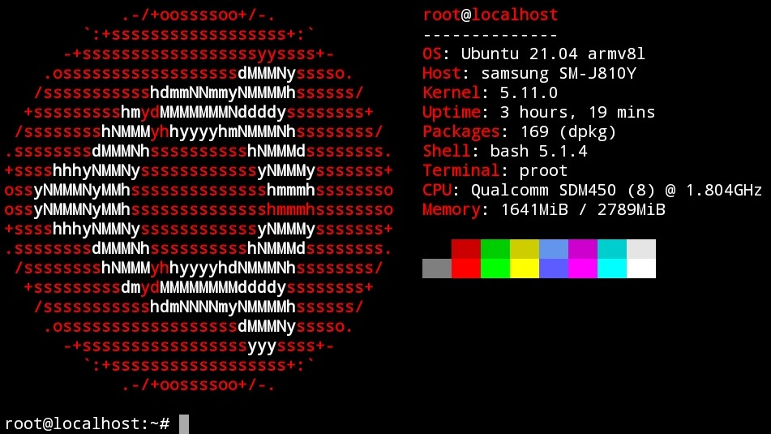

## Ubuntu 21.04 (Hirsute Hippo) in Termux

## Installation
```
curl --silent --location --remote-name https://raw.githubusercontent.com/trungtai33/ubuntu-hirsute-in-termux/master/install.sh && bash install.sh && rm install.sh
```
After installation, run ```start-ubuntu-hirsute``` to login.
## Uninstall
Be careful when using this command as it does not ask for confirmation.
```
curl --silent --location --remote-name https://raw.githubusercontent.com/trungtai33/ubuntu-hirsute-in-termux/master/uninstall.sh && bash uninstall.sh && rm uninstall.sh
```
